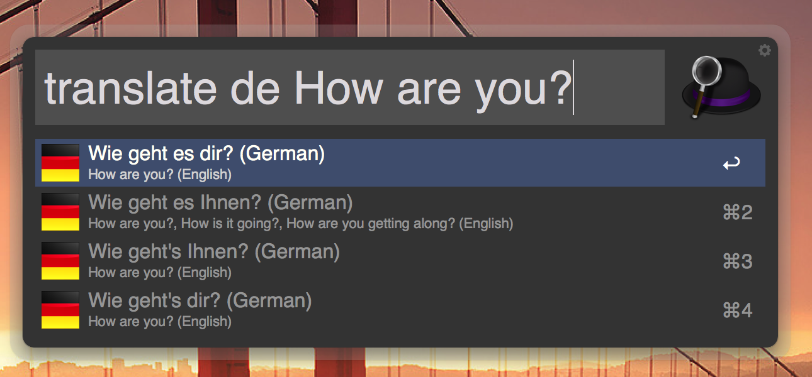
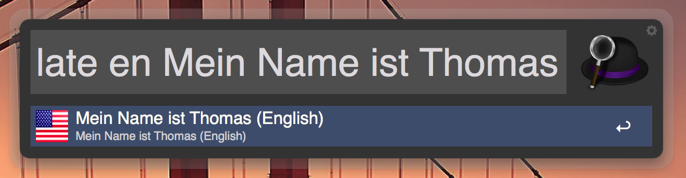
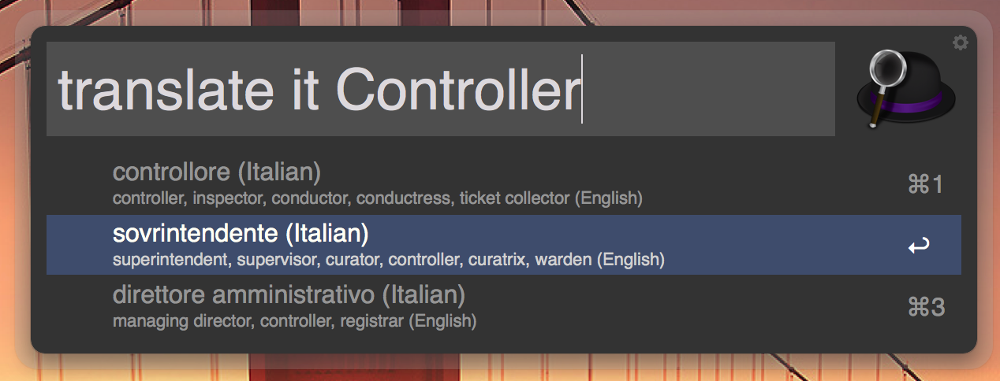
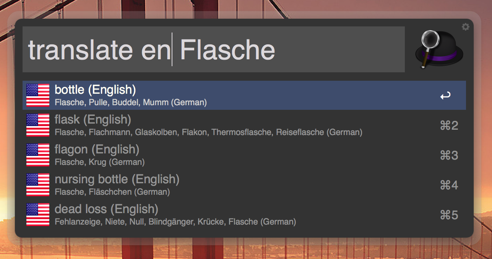

Google Translate Alfred Workflow
=============================

# Version 3.1.2

## Changelog

 * This integrates a library to get Google results without the problem of running into the request limit (see https://github.com/Stichoza/google-translate-php). The only downside I see at the moment, is that the used API only returns one result and no alternatives. But I guess it's better than not working at all.

## License

The MIT License (MIT)

Copyright (c) 2013-2016 Thomas Hempel <thomas@scriptme.de>

**Thanks to everyone who uses this workflow, gives feedback and provides fixes. You are awesome!!!**

**If you like the Workflow and use it a lot, please consider a small donation via [PayPal](https://www.paypal.com/cgi-bin/webscr?cmd=_s-xclick&hosted_button_id=54USV9NXE9WFY).** _If you don't like PayPal but still want to give me a little something, feel free to contact me via the e-mail address above. :-)_

A workflow for Alfred 2 that implements translation from any language to any other language known to Google.

It's based on PHP and not very complex to understand.

## How to install
Just download and double click the [workflow file](https://github.com/thomashempel/AlfredGoogleTranslateWorkflow/releases)
Say "yes" to import it into Alfred. Done!

## How to use
Open Alfred and type "translate" (or "gt") followed by the shortcode for the target language like "en" (english), "de" (german) or "it" (italian). You can find a complete list at the end of this document.

Since Version 3.0.0 there is a new target language format available. It is a simple comma separated list. In other words, if you want to translate to a specific combination of languages you can achieve that like this:

    gt fr,en Bildschirm

Of course you can still select the source and target like before. But keep in mind, that you can only set multiple target languages. For obvious reasons, you can't define multiple source languages.

The workflow will fall back to your default settings when a certain language is invalid. This also works in lists of languages. If you for example type something like

    gt en,ger,fr Haus

This would fallback to

    gt en,fr Haus

since "ger" is not a valid language identifier.

Normally the workflow will let Google decide which language you typed in. This doesn't fit in every case. For example if the word is ambiguous, spelled wrong or just means something different in another language.

Since version 2.1 you can define from and to which language you want to translate. You do this via the ">" or "<" operator and the respective language codes. Here a few examples:

    translate de>en Haus	// Will translate "Haus" from german to english.
    translate de>fr Auto	// Will translate "Auto" from german to french
    gt fr<en bottle			// Will translate "bottle" from english to french

As you can see, it's not pre-defined which language comes first. The source language or the target language. You define it by yourself with the operator ">" or "<" depending on what you prefer.

You can also leave the operator out at all. The behavior will be as in previous versions. You can only define the target language and we will let Google decide in which language you typed your search word in.

When Google delivered the result, you can just copy the one you want to the clipboard by selecting it and pressing enter.

Alternatively, since Version 2.2, you can open the original request directly on the Google website by pressing Alt+Enter.

If you want to have the result copied and pasted into your open document automatically, use Cmd+Enter when selecting the result. This works from Version 3.0.0.

## Settings

From Version 3.0.0 you can define the default values, that are used directly within the worflow. So, you no longer have to edit the source code files.

To show all available options and and their current value you can type

    gtset show

To change an option type gtset and the option name, followed by the value.

    gtset targetLanguage fr

You can take advantage of the new possibility to translate to several target languages at once. If you, for example, need to translate to english and french regularily, you can just set the default target languages like this:

    gtset targetLanguage en,fr

If the default value "auto" for your source language is not working well for you, it is possible to set your default source via

    gtset sourceLanguage de

__To set any option back to it's default value, you can simply set "default" as value.__

    gtset sourceLanguage default

## Languages

* auto = Automatic
* af = Afrikaans
* sq = Albanian
* ar = Arabic
* hy = Armenian
* az = Azerbaijani
* eu = Basque
* be = Belarusian
* bn = Bengali
* bg = Bulgarian
* ca = Catalan
* zh-CN = Chinese (Simplified)
* zh-TW = Chinese (Traditional)
* hr = Croatian
* cs = Czech
* da = Danish
* nl = Dutch
* en = English
* eo = Esperanto
* et = Estonian
* tl = Filipino
* fi = Finnish
* fr = French
* gl = Galician
* ka = Georgian
* de = German
* el = Greek
* gu = Gujarati
* ht = Haitian Creole
* iw = Hebrew
* hi = Hindi
* hu = Hungarian
* is = Icelandic
* id = Indonesian
* ga = Irish
* it = Italian
* ja = Japanese
* kn = Kannada
* km = Khmer
* ko = Korean
* lo = Lao
* la = Latin
* lv = Latvian
* lt = Lithuanian
* mk = Macedonian
* ms = Malay
* mt = Maltese
* no = Norwegian
* fa = Persian
* pl = Polish
* pt = Portuguese
* pt-BR = Brazilian Portuguese
* ro = Romanian
* ru = Russian
* sr = Serbian
* sk = Slovak
* sl = Slovenian
* es = Spanish
* sw = Swahili
* sv = Swedish
* ta = Tamil
* te = Telugu
* th = Thai
* tr = Turkish
* uk = Ukrainian
* ur = Urdu
* vi = Vietnamese
* cy = Welsh
* yi = Yiddish

## Screenshots
This is how it should look like:

## The end

Thanks for using the workflow!
Feel free to fork and/or make suggestions.

If you like the Workflow and use it a lot, please consider a small donation via [PayPal](https://www.paypal.com/cgi-bin/webscr?cmd=_s-xclick&hosted_button_id=54USV9NXE9WFY).

Best wishes,
Thomas
